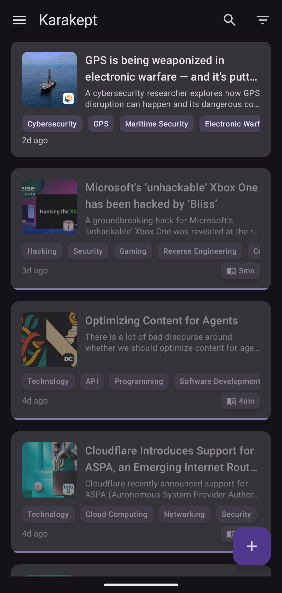
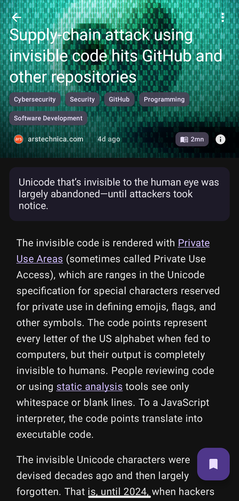
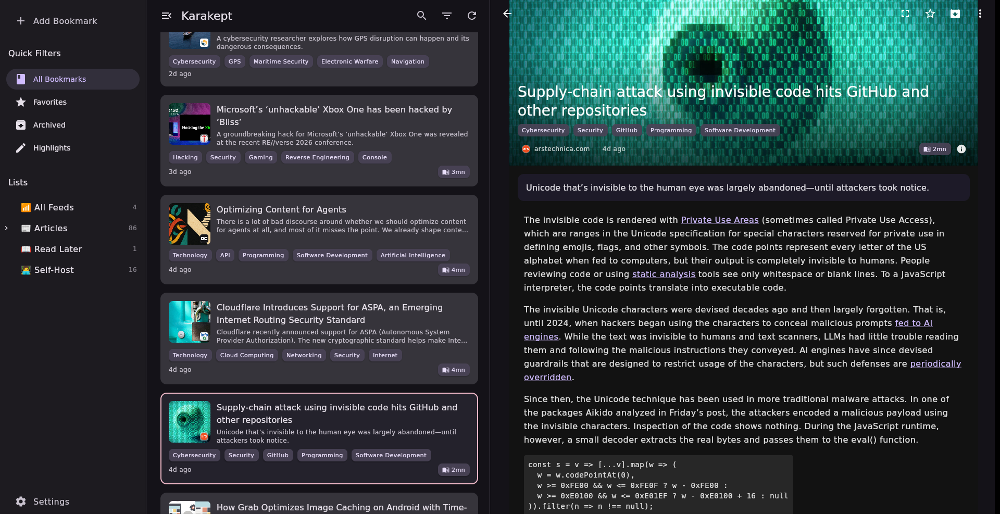

<p align="center">
  
</p>

<h1 align="center">Karakept</h1>

<p align="center">
  A Kotlin Multiplatform client for <a href="https://github.com/karakeep-app/karakeep">Karakeep</a> — manage your bookmarks on Android, MacOS and Linux Desktop.
</p>

<p align="center">
  <strong>Compose Multiplatform</strong> &bull; <strong>Material Design 3</strong> &bull; <strong>Offline-first</strong>
</p>

<p align="center">
  <a href="https://github.com/lmgarret/karakept-kmp/actions/workflows/ci.yml"></a>
  <a href="LICENSE"></a>
</p>

---

## Screenshots

<table align="center">
  <tr>
    <td align="center">
      
      <br /><em>Android — Bookmark list</em>
    </td>
    <td align="center">
      
      <br /><em>Android — Reader view</em>
    </td>
  </tr>
  <tr>
    <td align="center" colspan="2">
      
      <br /><em>Linux Desktop — Navigation drawer, bookmark list, and reader</em>
    </td>
  </tr>
</table>

## Features

- Browse, search, and filter bookmarks synced from your Karakeep server
- Customizable bookmark list layout (grid/list, density, sorting)
- Built-in reader view with customizable appearance
- Highlight support for saved articles
- Tag management and filtering
- Hierarchical list/folder navigation
- Offline access with local database
- System tray on Linux and macOS with quick bookmark creation from clipboard
- Dark theme with Material 3 dynamic colors

## Tech Stack

| | |
|---|---|
| **Language** | Kotlin 2.2.0 |
| **UI** | Compose Multiplatform 1.10.0 (Material 3) |
| **Navigation** | Voyager 1.1.0-beta03 |
| **Networking** | Ktor 3.3.2 |
| **Database** | Room 2.7.0-alpha11 |
| **DI** | Koin 4.0.0 |
| **Image loading** | Coil 3.0.0 |
| **HTML parsing** | KSoup 0.2.1 |

**Platforms:** Android (minSdk 24) and Desktop (JVM) on Linux, macOS, and Windows.

## Getting Started

### Prerequisites

- Java 17 or later (bundled in devcontainer)
- For Android: Android SDK
- For Desktop: X11 or Wayland display

### Android

```bash
# Debug build
./gradlew assembleDebug
# APK at: composeApp/build/outputs/apk/debug/composeApp-debug.apk

# Install on connected device
./gradlew installDebug
```

For a release build:
```bash
./gradlew assembleRelease
./gradlew installRelease
```

> The release build uses debug signing. For production, configure proper release signing in `composeApp/build.gradle.kts`.

### Desktop

```bash
./run_desktop.sh
```

The script auto-detects your display environment (X11, XWayland, Wayland, or headless via Xvfb) and launches the app. It also sets up D-Bus for system tray support.

#### Hot Reload (macOS / Linux / Windows)

For a faster iteration loop, use Compose Hot Reload — UI changes appear in the running app without restarting:

```bash
# Terminal 1 — start the app
./gradlew :composeApp:hotRunDesktop

# Terminal 2 — watch for changes and hot-swap
./gradlew -t :composeApp:reload
```

Save any `.kt` file and the UI updates in-place within a couple of seconds.

**Linux host setup** (for devcontainer GUI forwarding):
```bash
xhost +local:
```

**macOS**: Install [XQuartz](https://www.xquartz.org/), enable "Allow connections from network clients" in Preferences > Security, then log out and back in.

### Flatpak (Linux)

```bash
# Prerequisites
flatpak remote-add --user --if-not-exists flathub https://flathub.org/repo/flathub.flatpakrepo
flatpak install --user flathub org.gnome.Platform//46 org.gnome.Sdk//46

# Build and install
./gradlew packageFlatpak
flatpak install --user composeApp/build/flatpak/Karakept.flatpak
flatpak run com.karakept.app
```

### Distributable Package

```bash
./gradlew packageDistributionForCurrentOS
```

Produces platform-specific packages (DEB on Linux, DMG on macOS, MSI on Windows).

## Testing

### Unit Tests

```bash
./gradlew :composeApp:test
```

### Integration Tests

Requires Docker. Spins up a local Karakeep environment and runs end-to-end flows:

```bash
./gradlew :composeApp:desktopTest
```

HTML reports: `composeApp/build/reports/tests/desktopTest/index.html`

## Development Setup

### Devcontainer (Recommended)

Open the project in VS Code or any devcontainer-compatible editor and select **"Reopen in Container"**. The devcontainer includes Java 17, Android SDK with NDK, and all required tools.

### Manual

1. Install Java 17+
2. Install Android SDK
3. Set environment variables:
   ```bash
   export ANDROID_HOME=/path/to/android-sdk
   export ANDROID_SDK_ROOT=$ANDROID_HOME
   ```

## Project Structure

```
karakept-kmp/
├── composeApp/
│   └── src/
│       ├── commonMain/     # Shared UI, data layer, and business logic
│       ├── androidMain/    # Android platform implementations
│       └── desktopMain/    # Desktop platform implementations
├── assets/                 # App icons (SVG launchers, iOS icons)
├── docs/                   # Documentation and screenshots
├── flatpak/                # Flatpak build manifest
├── .devcontainer/          # Devcontainer configuration
└── gradle/                 # Gradle wrapper and version catalog
```

## Acknowledgments

Karakept is an independent, unofficial client for [Karakeep](https://github.com/karakeep-app/karakeep) — the open-source bookmark-everything app. This project is not affiliated with or endorsed by the Karakeep team. All credit for the backend, sync engine, and API goes to the Karakeep maintainers and contributors.

The code under `api-client/` is generated from Karakeep's [OpenAPI specification](https://github.com/karakeep-app/karakeep) using [OpenAPI Generator](https://openapi-generator.tech/).

Open-source libraries and fonts used by the app are credited in-app on the **About** screen.

## License

This project is licensed under the [MIT License](LICENSE).
